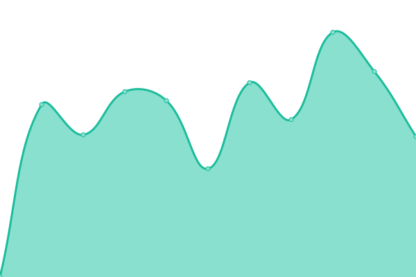
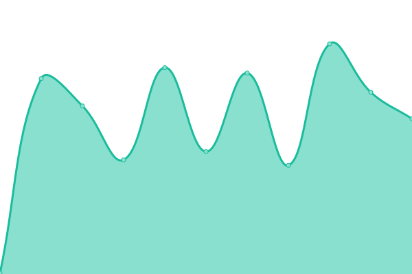
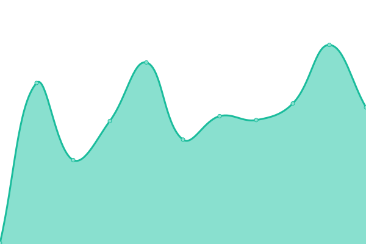
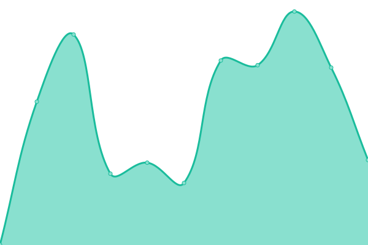

# [📈 Live Status](https://morganism.dev): <!--live status--> **🟧 Partial outage**

This repository contains the open-source uptime monitor and status page for [Morgan Sziraki](git.morganism.dev), powered by [Upptime](https://github.com/upptime/upptime).

With [Upptime](https://upptime.js.org), you can get your own unlimited and free uptime monitor and status page, powered entirely by a GitHub repository. We use [Issues](https://github.com/morganism/upptime/issues) as incident reports, [Actions](https://github.com/morganism/upptime/actions) as uptime monitors, and [Pages](https://git.morganism.dev) for the status page.

<!--start: status pages-->
<!-- This summary is generated by Upptime (https://github.com/upptime/upptime) -->
<!-- Do not edit this manually, your changes will be overwritten -->
<!-- prettier-ignore -->
| URL | Status | History | Response Time | Uptime |
| --- | ------ | ------- | ------------- | ------ |
|  [PASS Test 200](https://git.morganism.dev/upptime) | 🟩 Up | [pass-test-200.yml](https://github.com/morganism/upptime/commits/HEAD/history/pass-test-200.yml) | 

 724ms
     
 | 

<a href="https://git.morganism.dev/history/pass-test-200">100.00%</a>
    

|  [FAIL Test 404](https://git.morganism.dev/morganism.dev/status) | 🟩 Up | [fail-test-404.yml](https://github.com/morganism/upptime/commits/HEAD/history/fail-test-404.yml) | 

 125ms
     
 | 

<a href="https://git.morganism.dev/history/fail-test-404">100.00%</a>
    

|  Home Webhook Listener | 🟥 Down | [home-webhook-listener.yml](https://github.com/morganism/upptime/commits/HEAD/history/home-webhook-listener.yml) | 

 0ms
     
 | 

<a href="https://git.morganism.dev/history/home-webhook-listener">0.00%</a>
    

|  Home Status | 🟥 Down | [home-status.yml](https://github.com/morganism/upptime/commits/HEAD/history/home-status.yml) | 

 0ms
     
 | 

<a href="https://git.morganism.dev/history/home-status">0.00%</a>
    

|  Home VPN | 🟥 Down | [home-vpn.yml](https://github.com/morganism/upptime/commits/HEAD/history/home-vpn.yml) | 

 0ms
     
 | 

<a href="https://git.morganism.dev/history/home-vpn">0.00%</a>
    

|  [RemoteLock Web Portal](https://smartlock.devicewebmanager.com/) | 🟩 Up | [remote-lock-web-portal.yml](https://github.com/morganism/upptime/commits/HEAD/history/remote-lock-web-portal.yml) | 

 251ms
     
 | 

<a href="https://git.morganism.dev/history/remote-lock-web-portal">100.00%</a>
    

|  [RemoteLock API Service](https://api.remotelock.com) | 🟩 Up | [remote-lock-api-service.yml](https://github.com/morganism/upptime/commits/HEAD/history/remote-lock-api-service.yml) | 

 186ms
     
 | 

<a href="https://git.morganism.dev/history/remote-lock-api-service">100.00%</a>
    

|  [EC2 Docker Box](http://ec2-3-11-207-176.eu-west-2.compute.amazonaws.com:9000/) | 🟩 Up | [ec-2-docker-box.yml](https://github.com/morganism/upptime/commits/HEAD/history/ec-2-docker-box.yml) | 

 323ms
     
 | 

<a href="https://git.morganism.dev/history/ec-2-docker-box">100.00%</a>
    

|  [Pipedream](https://status.pipedream.com/) | 🟩 Up | [pipedream.yml](https://github.com/morganism/upptime/commits/HEAD/history/pipedream.yml) | 

 397ms
     
 | 

<a href="https://git.morganism.dev/history/pipedream">100.00%</a>
    

|  [Hive](https://status.hivehome.com) | 🟩 Up | [hive.yml](https://github.com/morganism/upptime/commits/HEAD/history/hive.yml) | 

 125ms
     
 | 

<a href="https://git.morganism.dev/history/hive">100.00%</a>
    

<!--end: status pages-->

[**Visit our status website →**](https://morganism.dev)

## 📄 License

- Powered by: [Upptime](https://github.com/upptime/upptime)
- Code: [MIT](./LICENSE) © [Morgan Sziraki](git.morganism.dev)
- Data in the `./history` directory: [Open Database License](https://opendatacommons.org/licenses/odbl/1-0/)
